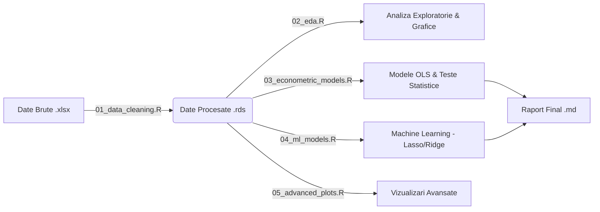

# Arhitectura Proiectului: Analiza Impactului AI asupra Pieței Muncii

## 1. Privire de Ansamblu (High-Level)
Acest proiect este un pipeline automatizat de analiză a datelor (Data Science Pipeline), scris în limbajul **R**. 
Scopul său este să preia date economice brute (Excel-uri de la Eurostat), să le curețe, să le integreze într-un singur set de date coerent și apoi să aplice modele statistice (Econometrie) și algoritmi de învățare automată (Machine Learning) pentru a testa ipoteze.

### Fluxul de Date (Data Flow)

---

## 2. Structura Directorului
Proiectul este organizat modular, respectând bunele practici în ingineria software (Separation of Concerns):

*   **`/data`**: "Memoria" proiectului.
    *   `/raw`: Aici stau fișierele originale descărcate (.xlsx). **Nu le modificăm niciodată manual** (principiu de reproductibilitate).
    *   `/processed`: Aici salvăm dataset-ul curat (`analysis_data.rds`) gata de analiză. Folosim formatul `.rds` pentru că păstrează tipurile de date din R (factori, numerice etc.).
*   **`/scripts`**: "Motorul" proiectului. Fiecare script are o responsabilitate unică.
*   **`/output`**: "Rezultatele". Aici sunt generate automat graficele (.png), tabelele și rapoartele. Dacă ștergem acest folder, el se regenerează rulând scripturile.
*   **`/docs`**: Documentația (ce citești acum).

---

## 3. Descrierea Componentelor (Script-uri)

### `00_setup.R` (Inițializare)
*   **Rol:** Pregătește mediul de lucru.
*   **Ce face:** Verifică dacă ai librăriile necesare instalate (`tidyverse`, `caret`, `glmnet` etc.). Dacă nu le ai, le instalează automat. Creează structura de foldere dacă nu există.

### `01_data_cleaning.R` (ETL - Extract, Transform, Load)
*   **Rol:** Cel mai complex script. Transformă "gunoiul" (date brute, neformatate) în "aur" (dataset curat).
*   **Logica:**
    1.  Citește fiecare fișier Excel (EMP_TECH, DESI_AI, etc.).
    2.  Identifică rândul corect cu header-ul (uneori e rândul 8, alteori 10).
    3.  Selectează coloana cu anul cel mai recent (2023 sau 2022).
    4.  Standardizează codurile de țară (ex: "Germany" -> "DE").
    5.  Face `JOIN` (unire) între toate tabelele pe baza cheii `geo` (codul țării).
    6.  Rezolvă valorile lipsă (NA) prin imputare (media europeană).

### `02_eda.R` (Exploratory Data Analysis)
*   **Rol:** "Detectivul". Ne ajută să înțelegem datele înainte de modelare.
*   **Ce face:**
    *   Calculează statistici (medie, deviație standard).
    *   Desenează histograme (distribuția datelor) și boxplot-uri (outlieri).
    *   Face **Clustering (K-Means)**: Grupează țările automat în "clustere" (ex: Țări avansate vs Țări emergente) pe baza asemănării datelor.

### `03_econometric_models.R` (Econometrie Clasică)
*   **Rol:** Testează ipotezele științifice.
*   **Ce face:**
    *   Rulează regresii liniare (OLS). Ex: `EMP_TECH = alpha + beta1*DESI_AI + eroare`.
    *   Verifică dacă relația e "reală" sau doar o coincidență (p-value < 0.05).
    *   Aplică teste de diagnostic: Heteroskedasticitate (B-P test), Multicoliniaritate (VIF).

### `04_ml_models.R` (Machine Learning)
*   **Rol:** Predicție și Selecție.
*   **Ce face:**
    *   Folosește algoritmi de regularizare (**Lasso** și **Ridge**).
    *   Acești algoritmi sunt mai "deștepți" decât OLS când avem multe variabile corelate.
    *   Lasso poate reduce coeficienții variabilelor inutile la ZERO (selecție de feature-uri).

### `05_advanced_plots.R` (Vizualizare)
*   **Rol:** Prezentare.
*   **Ce face:** Generează grafice "frumoase" pentru raport (Heatmap, Scatterplot cu etichete, Bar charts comparative).

---

## 4. De ce am ales aceste tehnologii?
*   **R vs Python**: Pentru analize statistice și econometrice pe date tabulare mici/medii, R este adesea preferat în mediul academic datorită pachetelor *tidyverse* (manipulare date extrem de curată) și *stargazer* (tabele de regresie gata de publicare).
*   **Excel**: Doar ca sursă de date input (formatul standard Eurostat). Nu facem calcule în Excel pentru că nu sunt reproductibile (greu de urmărit cine ce celulă a modificat).

Acest proiect demonstrează un flux de lucru **profesionist**, similar cu ce se întâmplă în echipele de Data Science din corporații: cod modular, reproductibil și bine documentat.
